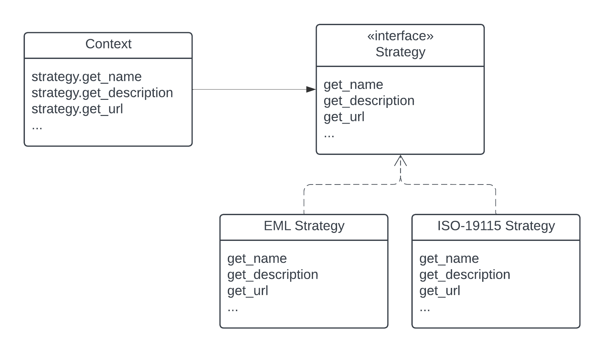
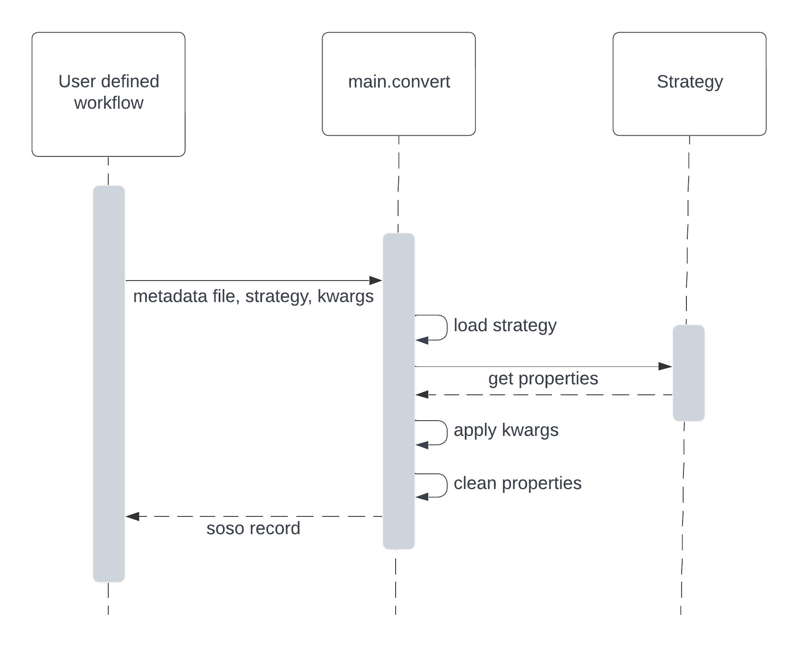

.. _design:

Project Design
==============

Welcome to the design document for our project! This document provides an in-depth overview of the architectural design, key components, and design principles behind our work. It aims to enhance your understanding of our project's design philosophy and empower you to contribute effectively.

We encourage you to explore this document and reach out with any questions or suggestions. Your feedback is invaluable as we continuously improve and evolve our project.

Introduction
------------
This software converts scientific metadata standards into Science-On-schema.Org (SOSO) JSON-LD, which can be embedded in the landing pages of data repository datasets for harvesting by search engines (like Google) and other applications.

Currently, most repositories have their own implementations, however, a shared implementation offers some advantages:

* Facilitates the adoption of SOSO conventions through an intuitive application.
* Promotes community-wide consistency by providing a standardized approach to metadata conversion.
* Simplifies updates to SOSO records as standards and conventions evolve, ensuring that dataset metadata remain current and interoperable.

Functional design requirements we considered in the development of this application:

* Convert any metadata standards to SOSO.
* Use metadata mappings that enable control over the degree of output accuracy.
* Test against a consistent set of criteria.
* Customizable to enable unique use cases.

Non-functional design requirements we considered:

* The application should be intuitive for novice users.
* Meets performance requirements for batch conversion or real-time updates of metadata records in data repositories.

System Architecture
-------------------

Strategy Pattern
~~~~~~~~~~~~~~~~

The system architecture implements the `Strategy Pattern`_, a behavioral design pattern that allows us to define a set of algorithms for converting metadata, encapsulate each one, and make them interchangeable. This pattern enables the client code to choose an algorithm or strategy at runtime without needing to know the details of each algorithm's implementation. This flexibility applies not only to metadata conversion but also to a test interface implementing a consistent set of checks.

.. _Strategy Pattern: https://en.wikipedia.org/wiki/Strategy_pattern

Implementation Overview:

* Strategy Interface (`src/soso/interface.py`): This interface declares a method signature that all modules must implement, serving as a common contract between modules. We’ve structured the methods around the creation of SOSO properties, since these are conceptually understandable and contained.
* Strategies (`src/soso/strategies/`): These strategies are classes that implement the interface and are organized into different modules. Each module may include additional utility functions to aid implementation.
* Context (`src/soso/main.py`): The primary client-side logic manages the main workflow. The user's chosen strategy is instantiated dynamically at runtime, with additional inputs such as the metadata document and any relevant information used by the strategy implementation.

With this pattern, new support for metadata standards or versions can be easily added as strategy modules without modifying the client code or test suite.

Users typically define workflows that involve iterating over a series of metadata files. Each file, along with its corresponding strategy, is passed to `main.convert`, which returns a SOSO record.

Metadata Mapping
~~~~~~~~~~~~~~~~

We utilize the `Simple Standard for Sharing Ontological Mappings`_ (SSSOM, version 0.15.0) for semantic mapping SOSO to metadata standards. SSSOM provides a framework for expressing the match accuracy and other essential information, guiding developer implementations and enabling users the potential to control the accuracy of outputs.

.. _Simple Standard for Sharing Ontological Mappings: https://mapping-commons.github.io/sssom/about/

Testing
~~~~~~~

The test suite utilizes the strategy design pattern to implement a standardized set of checks that all strategies must undergo.

It verifies that returned properties adhere to the expected data types specified by the SOSO conventions. Furthermore, it ensures that non-empty "meaningless" results are not returned, thereby preventing the accumulation of unnecessary detritus in the resultant SOSO record.

Additionally, the test suite conducts integration tests against full SOSO records anticipated to be generated by each strategy when processing a representative input metadata file. These tests validate all changes, whether intentional or unintentional, ensuring that the output conforms to the overarching requirements.

Customization
~~~~~~~~~~~~~

The Strategy Pattern employed in our application enables a high degree of user customization to solve common challenges:

* Properties requiring additional processing due to data repository-specific implementations of metadata standards.
* Properties that don't map to metadata but require external data, such as dataset landing page URLs.

These cases are efficiently addressed through a combination of inputting data via `kwargs` and implementing custom processing via method overrides, as demonstrated in the example below.

Alternative Implementations Considered
~~~~~~~~~~~~~~~~~~~~~~~~~~~~~~~~~~~~~~

Before settling on the Strategy Pattern as the design for this project, we considered the use of JSON-LD Framing. This approach involves converting a metadata record to JSON-LD, applying a crosswalk to obtain equivalent SOSO properties, and structuring the result with a JSON-LD Frame (e.g., EML.xml => EML.jsonld => crosswalk => Frame.jsonld => SOSO.jsonld).

The benefits of the JSON-LD Framing approach include ease of extension to other metadata standards through the creation of new crosswalks and simplified maintenance, as modifications are primarily made to the crosswalk file. However, this approach has its downsides. Some metadata standards cannot be serialized to JSON-LD, necessitating additional custom code. Additionally, when dealing with metadata standards with nested properties, framing results in information loss, as framing works best for flat sets of properties.

Ultimately, we determined that the potential loss of information during conversion outweighed the benefits of simplified maintenance. Furthermore, it was not evident that JSON-LD Framing offered a less complex solution compared to the Strategy Pattern.

System Details
--------------

Strategy Interface
~~~~~~~~~~~~~~~~~~

Intentionally Vague Return Types
^^^^^^^^^^^^^^^^^^^^^^^^^^^^^^^^

In the docstrings of the strategy interface, the descriptions of expected returned data types are intentionally left vague (i.e. `Any`). This approach accommodates the variability in the expression of SOSO properties for a given set of equally variable inputs. It aims to provide clear expectations to users while avoiding the repetition of details found in SOSO specifications and Schema.org documentation. For example, consider the `get_keywords` method: depending on whether the input is a simple list of keywords or a list of defined terms, this method may return a list of Python strings or dictionaries.

Returning Clean Properties
^^^^^^^^^^^^^^^^^^^^^^^^^^

The `delete_null_values` function is applied to all strategy methods to eliminate meaningless null values from their outcomes. This implementation enhances the usability and efficiency of strategy methods by users and aids in the graph cleaning step of `main.convert`.

Metadata Mapping
~~~~~~~~~~~~~~~~

Implementation
^^^^^^^^^^^^^^

We've implemented metadata mappings following `SSSOM guidelines`_, with some nuanced additions tailored to our project's needs. One such addition is the inclusion of a `subject_category` column, which aids in grouping and improving the readability of highly nested `subject_id` values. Additionally, we've formatted `subject_id` values using an arbitrary hierarchical path-like expression, enhancing clarity for the reader in understanding which property is being referenced. Note, while this path is human-readable, it is not machine-actionable.

Beyond these general differences, each metadata standard's mapping may have unique nuances that should be considered. These are documented in each metadata standard's SSSOM .yml file, located in the `src/soso/data/` directory.

Creating or updating a metadata standard's SSSOM files involves subjectively mapping properties. To mitigate subjectivity, we've established a set of mapping guidelines (see below). Additionally, we recommend having a second set of eyes review any mapping work to identify potential biases or misunderstandings. The original mapping creator is listed in the SSSOM and can serve as a helpful reference for clarification.

Before committing any changes to SSSOM files, it's a good practice to thoroughly review them to ensure unintended alterations haven't been made to other parts of the SSSOM files. Given the file's extensive information and nuanced formatting, careful attention to detail is important.

.. _SSSOM guidelines: https://mapping-commons.github.io/sssom/mapping-predicates/

Predicate Mapping Guidelines
^^^^^^^^^^^^^^^^^^^^^^^^^^^^

Our predicate mapping guidelines are based on the `SSSOM guidelines`_, expanding to provide direction for our specific application context. In addition to the SSSOM guidelines, two key factors inform the selection of a mapping predicate: property definition and property type.

**Definitions**: Definitions represent the underlying semantic meaning of a property, discerned by understanding the definitions of the properties being mapped, while considering any relevant context that may influence interpretation.

**Types**: Types denote the data types in which properties are expressed. Types often adhere to a hierarchy, for example:

* Text > URL > URI > IRI (e.g., Text is broader than URL, and URL is broader than URI)
* Text > Numeric > xsd:decimal (e.g., Text is broader than Numeric, and Numeric is broader than xsd:decimal)
* schema:Date > schema:DateTime (e.g., schema:Date is broader than schema:DateTime)

We've categorized mapping predicates into two cases to expedite definition pinpointing.

**When Definitions Match**: Consider these predicates:

* `skos:broadMatch`: Definitions match, but object type is broader.
* `skos:narrowMatch`: Definitions match, but object type is narrower.
* `skos:exactMatch`: Definitions and types match precisely.

Sometimes, the object is a constant value specified by mapping set curators, forming an exact match by fiat.
Additionally, if the object is composed of multiple parts needing assembly in a specific way to match the subject definition and type, it's acceptable.

**When Definitions Don't Match**: Use these predicates:

* `skos:closeMatch`: Definition doesn't match, but is close (refer to SSSOM guidelines for clarification). Object type may or may not match.
* `skos:relatedMatch`: Definition doesn't match, but broadly aligns with an analogous concept in a different category (refer to SSSOM guidelines for clarification), and the object type doesn't match.
* `sssom:NoMapping`: No match found for any of the listed types.

Note, if the object type can be transformed to form an exact match with the subject type through a strategy's conversion method, consider the types identical and declare an exact match in the SSSOM file. Add a note to the SSSOM file to inform developers and maintainers of this decision.

For any inquiries, please reach out to the group. Mapping work is fun but can be challenging!

Testing
~~~~~~~

Strategy Interface
^^^^^^^^^^^^^^^^^^

`test_interface.py`: Checks for the presence of strategy features (e.g. has a metadata attribute, has expected methods).

Strategies
^^^^^^^^^^

`test_[standard].py`: Requires only creating a strategy instance, essentially a metadata record read into the strategy module and run through each method in the strategy, except for skipped tests (see below).

**Property Values**

`test_[standard].py` methods: SOSO properties have expected values with predefined data types (e.g., Numeric) and structures (e.g., Dictionaries with specific keys and values). To maintain consistency and adhere to the Don't Repeat Yourself (DRY) principle, we abstract types and structures into generalities that we test for. We've created a utility testing function to assist with this, using the `is_property_type` function. This function should be applied to every property method test.

**Detritus-Free Results**

We advocate for developers to return useful content by testing for graph detritus (null values). We test this by ensuring that strategy methods return a None value instead of null (empty) values (e.g., "" for strings) or containers (e.g., [] for lists). Properties with None values are removed in the final graph cleaning step of `main.convert` before being returned to the user.

**Skipping Tests**

Tests for methods not implemented for a strategy must be skipped, as the strategy interface tests will run every method test. To skip tests, we explicitly identify which tests are skipped for which strategies and why using the `@pytest.mark.skipif` decorator in the `test_strategies.py` module. We use one of three explanations, although other rationales may be given when necessary:

* "Method Not Yet Implemented": Used during active development of a strategy when a strategy method has not been implemented yet but is planned to be. This tag is removed incrementally as methods are implemented.
* "Property Not in Schema": Applied when the source metadata does not include content within the schema for the target property the strategy method is intended to extract. In such cases, the corresponding test is skipped indefinitely.
* "Content Missing from Test Metadata": Indicates that although the property is supported by the metadata's schema, the test metadata is missing the content and should be added. This condition should be temporary.

Integration Tests
^^^^^^^^^^^^^^^^^^

Verification testing helps address gaps in our unit tests by verifying the consistency of inputs and outputs produced by the system. This mitigates the risk of unexpected deviations. We maintain a static snapshot of `main.convert` results (JSON-LD file) captured at the time of the most recent modification to a strategy. Developers are responsible for updating this snapshot when changes occur and are reminded to manually inspect and validate the anticipated changes to this file before committing a new snapshot to the test suite.

Utilities
^^^^^^^^^

Strategy-specific utility functions are tested in their own test suite module named `test_[strategy].py`. General utility functions used across different strategies are tested in `test_utilities.py`.

