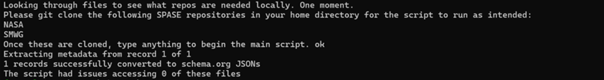

.. _spase_HowToConvert:

SPASE-schema.org Conversion Script
==================================

**Author: Zach Boquet**

Introduction
------------

This python script provides a method of converting **SPASE (Space Physics Archive Search and Extract)** metadata records into Schema.org JSON-LD files aligned with the Science-On-Schema.Org ESIP-endorsed standards for expressing datasets on Schema.org. The produced Schema.org JSON-LD files are intended to be embedded within the associated SPASE record's landing page. This embedding helps improve SPASE's data discovery through search engines such as Google. This guide walks you through how to produce these JSON-LD files, step by step.

First, the script iterates through all SPASE records provided by the user to determine which GitHub SPASE repositories are needed to be accessible locally in order to ensure as much metadata is harvested from the SPASE record(s) as reasonable. The script informs the user of those "required" repos and then starts the process of converting the SPASE records into JSON-LD files. The first stage in this process is harvesting metadata from the records using the python package, lxml  (e.g., https://lxml.de/tutorial.html). For each metadata field harvested, the script simultaneously formats this metadata according to the schema.org dataset schema and following the guidance provided by the Science-On-Schema.Org group for datasets. Lastly, these JSON-LD files are then saved within a local directory called *SPASE_JSONs*, following the same path format as it is in the SPASE repository.

- The latest SPASE metadata schema is available at `https://spase-group.org/data/schema/spase-latest.xsd <https://spase-group.org/data/schema/spase-latest.xsd>`_.
- Schema.org's official metadata schema for datasets used for this script is `https://schema.org/Dataset <https://schema.org/Dataset>`_.
- The schema.org JSON-LD validator tool used to test the outputs from this script is `https://validator.schema.org/ <https://validator.schema.org/>`_.
- Science-on-Schema.Org's guidelines for dataset metadata used for this script is `https://github.com/ESIPFed/science-on-schema.org/blob/main/guides/Dataset.md <https://github.com/ESIPFed/science-on-schema.org/blob/main/guides/Dataset.md>`_.
- The documentation for Google's guidelines for dataset metadata is `https://developers.google.com/search/docs/appearance/structured-data/dataset#dataset <https://developers.google.com/search/docs/appearance/structured-data/dataset#dataset>`_.
- Google's Rich Results Tool used to verify your dataset's discoverability is `https://search.google.com/test/rich-results <https://search.google.com/test/rich-results>`_.

*Note that this script harvests and formats additional metadata available in the record(s) than what is supported by soso. Also, this code was extensively tested on the NASA SPASE Github repo, specifically the NumericalData and DisplayData directories. While we encourage the use of this script on other SPASE Github repos, this may require extra tinkering in order to fit your community/agency's desired formatting and/or other guidelines.*

*Furthermore, an additional disclaimer to make with this script is that due to the current structure of SPASE, it can be quite difficult to easily and reliably distinguish authors which are an organization/consortium. Logical rules have been implemented which help address this issue, but it is not 100% accurate, especially when it comes to consortiums. This weakness is soon to be resolved in SPASE 3.0.*

Installation
------------

First, ensure that you have installed the latest soso package. Instructions are given at :doc:`Quick Start <../quickstart>`.

Next, in order for the script to be able to harvest metadata, it needs access to a local directory of your chosen SPASE repository. No matter which repo you choose, you will likely need the `SMWG repo <https://github.com/hpde>`_ as well, since it contains additional information about creators, contributors, instruments, observatories, etc. You must clone all needed repositories in your HOME directory in order for the script to work as intended.

You can view the cloning instructions for your desired SPASE repository by visting their repo at the `hpde group Github <https://github.com/hpde>`_ and viewing their README file.

For example, the command to clone the hpde/SMWG repository is given below. **Remember to run this command and all other cloning commands within your HOME directory.**

    $ git clone -b master --single-branch --depth=1 https://github.com/hpde/SMWG

Execution
---------

The main script responsible for converting SPASE records to Schema.org JSONs is ``conversion.py``. This conversion script utilizes the extraction and formatting code found in ``spase.py`` and then saves these newly formatted metadata in a local directory called ``SPASE_JSONs``.

You can run this script via the command line by following this blueprint: ``python <path to conversion.py> <folder> <additional_license_info>``.

An example command following this blueprint would look like: ``python ./src/soso/conversion.py C:/Users/YourUsername/NASA/NumericalData/MMS/4/HotPlasmaCompositionAnalyzer/Burst/Level2/Ion``

The meaning of ``folder`` and ``additional_license_info`` (which is optional) is given below:

- ``folder``: The path to the directory/text file containing SPASE records that the user wishes to create schema.org JSONs for.
- ``additional_license_info``: An **optional** argument used to pass an additional metadata license not currently included within the *common_licenses* list in the *get_subject_of* function in ``spase.py``. The format should follow: [<full name>, <identifier>, <url>].

For example, the output of the command to run the main ``conversion.py`` script using a folder containing a well-populated SPASE record is given below. This command uses *\<HOMEDIR\>/NASA/NumericalData/MMS/4/HotPlasmaCompositionAnalyzer/Burst/Level2/Ion* as the argument to ``<folder>``.

After this command is completed, you should notice that the associated JSON, ``NASA/NumericalData/MMS/4/HotPlasmaCompositionAnalyzer/Burst/Level2/Ion/PT0.625S.json``, is now created within the *SPASE_JSONs* folder.

Optional Parameter: 'additional_license_info'
^^^^^^^^^^^^^^^^^^^^^^^^^^^^^^^^^^^^^^^^^^^^^

If your repository's metadata license is not *CC0-1.0*, *CC-BY-NC-3.0*, or *CC-BY-1.0*, then you must provide your repository's metadata license info as the parameter ``additional_license_info`` mentioned above. If your repository's metadata license is listed above, you may skip this explanation.

This ``additional_license_info`` must be a list of three items describing your repository's metadata license, as shown above. The ``<full name>`` and ``<identifier>`` items should be pulled from the `SPDX License List Page <https://spdx.org/licenses/>`_. The ``<url>`` can then be formed by adding 'https://spdx.org/licenses/' in front of the identifier value.

An example command including this optional parameter would look like: ``python ./src/soso/conversion.py C:/Users/YourUsername/NASA/NumericalData/MMS/4/HotPlasmaCompositionAnalyzer/Burst/Level2/Ion ["MIT License", "MIT", "https://spdx.org/licenses/MIT"]``

Passing your repository's specific metadata license will allow for the `subjectOf <https://schema.org/subjectOf>`_ schema.org property to be richly populated.